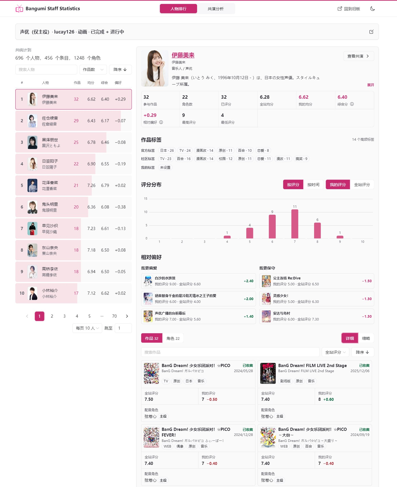
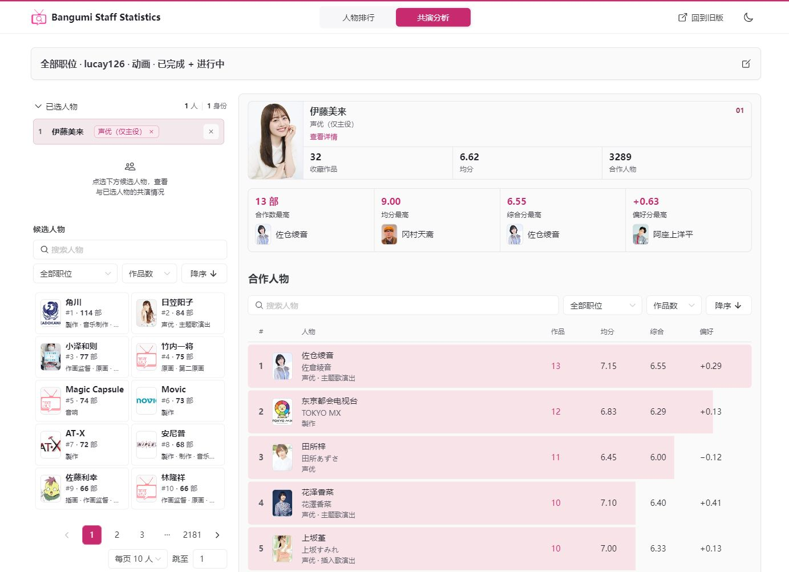
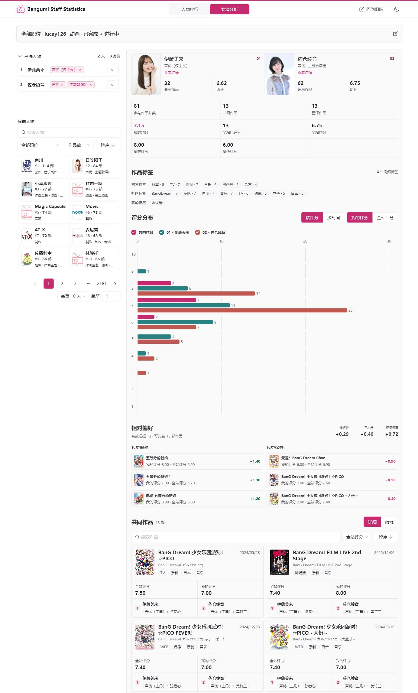
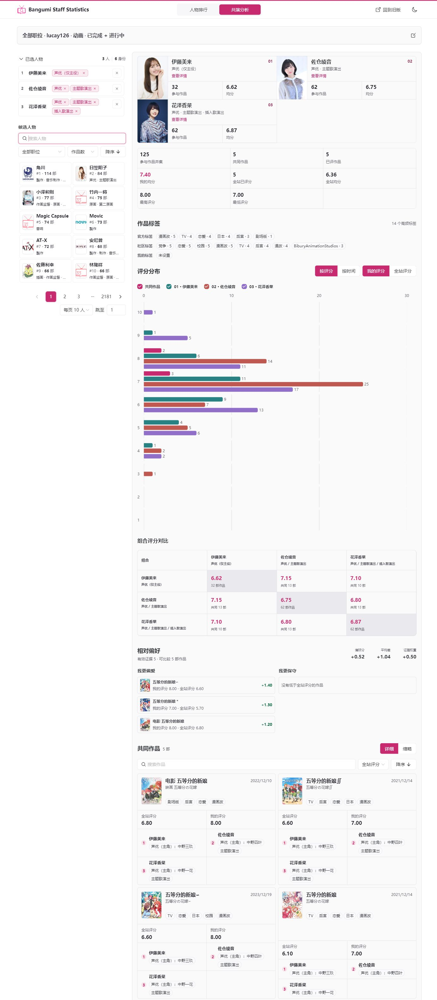

# Bangumi Staff Statistics：Bangumi 人物排行与共演分析

从你的 Bangumi 收藏出发，看看自己接触过哪些声优、导演和创作者，他们参与了多少作品、你给了怎样的评价，以及哪些人经常一起出现在作品中。也可以切换到全站数据，查询更广的作品与合作关系。

**[打开网站](https://search.bgmss.fun/)** · [使用旧版](https://search.bgmss.fun/old/) · [讨论与反馈](https://bgm.tv/group/topic/407903)

新版保留个人收藏与全站人物统计，增加了共演分析，并重新整理了查询、人物详情和作品浏览界面。

## 开始查询

1. 打开网站，选择「人物排行」或「共演分析」。
2. 使用个人数据时，填写 Bangumi 用户 ID，例如 `lucay126`。这是个人主页中 `@` 后面的用户名，不是昵称；无需登录本站。
3. 选择条目类型、职位和收藏状态，按需添加筛选条件。
4. 点击「开始查询」，随后浏览人物和作品。

个人模式支持公开收藏，可组合选择在看、看过、搁置、抛弃等状态，对应名称随条目类型变化。全站模式不需要填写用户 ID，统计范围为本站已收录的 Bangumi 数据。

以下演示于 2026 年 9 月 11 日使用 `lucay126` 的公开收藏查询：动画、看过与在看，起始职位为「声优（主役）」，未开启合并续作及其他筛选。进入共演后浏览全部职位，并保留每个人实际选中的身份。结果可能随收藏和 Bangumi 资料变化。

## 人物排行

按参与作品数量或评分查看人物排名，点击人物后继续查看其资料与参与作品。

| 指标 | 含义 |
| --- | --- |
| 作品数 | 当前查询范围内，该人物参与的不同作品数；合并续作后按系列计数。 |
| 均分 | 当前范围内有有效评分的作品的平均分，未评分作品不按零分计入。 |
| 综合分 | 同时考虑均分和有效评分作品数，样本越少越向 5 分靠拢，减少少量作品带来的极端排名。 |
| 相对偏好 | 仅个人模式提供。比较同一作品的「我的评分－全站评分」，再结合样本数量调整；正数表示总体打得更高，负数表示更低，样本少时更接近零。 |

个人模式可比较自己的评分与全站评分；全站模式只显示全站指标。没有可用评分或偏好证据时显示「—」。相对偏好描述你对作品的评价差异，不代表对人物本人的直接打分。

排行支持升降序、人物搜索与分页。搜索不会重新编号，因此搜索结果中可能出现不连续的名次。

### 人物详情

详情集中展示人物资料、统计指标、作品标签、评分分布，以及个人模式下相对偏好对应的具体作品。可以继续搜索、排序和翻看参与作品；查询声优时，还能浏览配音角色及其出处。

点击「查看共演」，可以沿用当前收藏和筛选条件，以这位人物为起点查看合作关系。

## 共演分析

「共演」既可以查询声优之间的共同出演，也可以查询导演、脚本、原画等不同职位之间的共同参与。

### 从一个人查看合作对象

选中一位人物，查看当前范围内与其有共同作品的合作对象。合作列表支持按共同作品数、均分、综合分等指标排序；个人模式还可以看相对偏好。可通过职位筛选缩小合作对象范围，再点击感兴趣的人进入两人分析。

### 查看两人共同作品

选中两人后，可以查看共同作品、评分分布和标签，在个人模式下比较自己的评价与全站评价，并查看偏好对应的作品。

共同作品卡片会列出每个人在该作品中的参与职位；声优还会显示对应角色。

### 多人组合与跨职位分析

支持选择 **2～10 位人物**，查看所有人共同参与的作品、评分与标签；三人及以上还可比较组合内的两两合作情况。候选人物随已选组合收窄：选中 A 后只保留与 A 有共同作品的身份，选中 A、B 后只保留能与 A、B 共同参与同一作品的身份，避免选到没有共同作品的组合。增删人物或身份后会自动刷新候选。

每位人物可以选择一个或多个参与职位，合计最多 **20 个「人物＋职位」身份**。例如，可以比较一位导演与两位声优共同参与的作品，也可以合并同一人物作为导演和脚本的参与记录。已选人物区可增加、移除职位或移除整个人物。

共同参与以同一个原始作品条目为准。两人分别参与同系列的不同作品，不会仅因系列相同而被算作共演。

## 条目类型与职位

| 条目类型 | 职位举例 |
| --- | --- |
| 动画 | 声优、声优（主役）、导演、动画制作、脚本、系列构成、原作、分镜、原画等 |
| 书籍 | 作者、原作、脚本、插图、出版社等 |
| 音乐 | 艺术家、作曲、编曲、作词、制作人等 |
| 游戏 | 声优、声优（主役）、开发、剧本、原画、音乐等 |
| 影视 | 导演、编剧、主演、配角、摄影、音乐等 |

完整职位以网站当前选项为准，可按分类浏览或搜索。声优支持全部出演，以及主役、配角、客串、闲角、旁白、声库六种具体角色范围，同一条目类型只能选择一种范围。

人物排行多选职位时，只统计**同时具备全部所选职位**的人物，其作品合并去重。共演分析的职位选择用于寻找候选人物，也可使用「全部」范围，再为各人物指定实际参与身份。

## 筛选条件

| 条件 | 用途 |
| --- | --- |
| 作品日期 | 按作品播出、发行等日期缩小范围。 |
| 收藏时间 | 仅个人模式；按收藏记录最后更新时间筛选。修改状态、评分或短评也会更新这个时间。 |
| 我的评分、全站评分 | 分别限定作品的个人评分与全站评分范围。 |
| 我的评分与全站评分差 | 仅个人模式；按个人评分减去全站评分的差值筛选。 |
| 评分人数 | 限定作品的全站有效评分人数；不是收藏人数，也不参与综合分加权。 |
| 正向、反向标签 | 保留或排除指定题材、类型等标签的作品。 |
| 显示 NSFW 条目 | 按需纳入相关条目。 |

正向标签项之间要求全部满足，同一项内用 `/` 表示任选其一。例如分别添加 `百合` 和 `原创/漫画改`，会保留百合题材的原创或漫画改作品。

反向标签命中任一项就排除，同一项内用 `+` 表示同时包含。例如分别添加 `百合+校园` 和 `原创`，会排除原创作品，以及同时带有百合、校园标签的作品。

## 合并续作与浏览体验

查询动画时可启用「合并续作」，将续作关系中的条目按系列整理，也可能包含总集篇、番外、衍生及不同演绎。数量与评分按系列统计，系列之间等权；只计算当前筛选范围内该人物实际参与的作品。共演分析先找共同作品，再合并系列。可以展开系列查看其中作品，配音角色仍对应其原始出处。

人物、作品和角色支持名称搜索；系列可搜索系列名及系列内作品。作品区可切换详细与缩略显示，页面适配桌面和手机，并提供深浅色主题。

修改查询条件后，点击「开始查询」才会更新结果。人物排行与共演分析可以沿用同一份已应用条件切换；当前标签页刷新后会尝试恢复上次成功的查询并重新加载数据。

## 数据来源与反馈

数据来自 [Bangumi](https://bgm.tv/)，使用其[公开接口](https://github.com/bangumi/api)与[公开数据归档](https://github.com/bangumi/Archive)。个人查询仅支持可公开读取的收藏，不能查看私密收藏。

结果受收藏公开状态、人物与作品关联资料、评分和标签完整程度影响，资料更新也可能有延迟。系列关系不一定完全符合你的理解，遇到疑问可以展开作品核对。

欢迎在 [Bangumi 讨论帖](https://bgm.tv/group/topic/407903)反馈问题或建议。反馈查询问题时，附上用户 ID、条目类型、职位、筛选条件及截图，会更方便复现。
